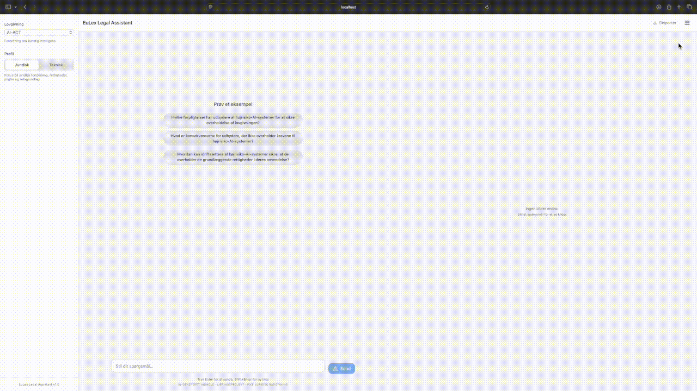
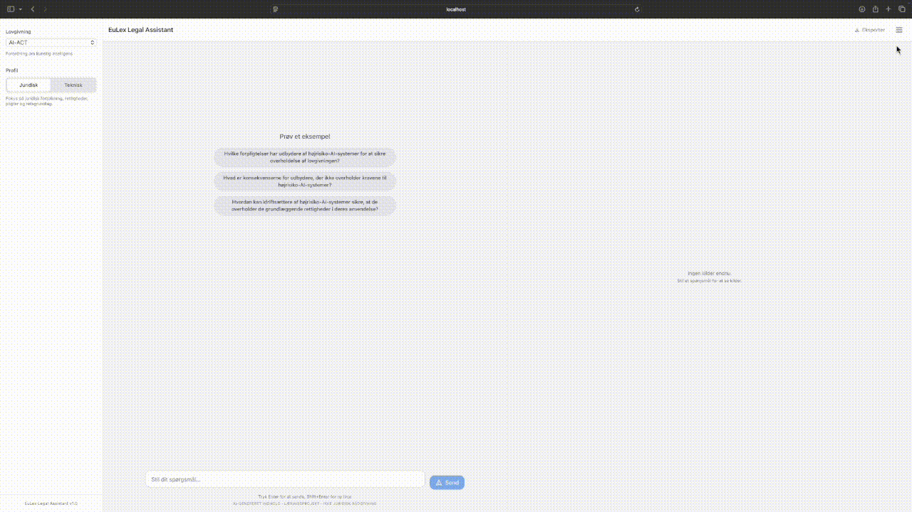
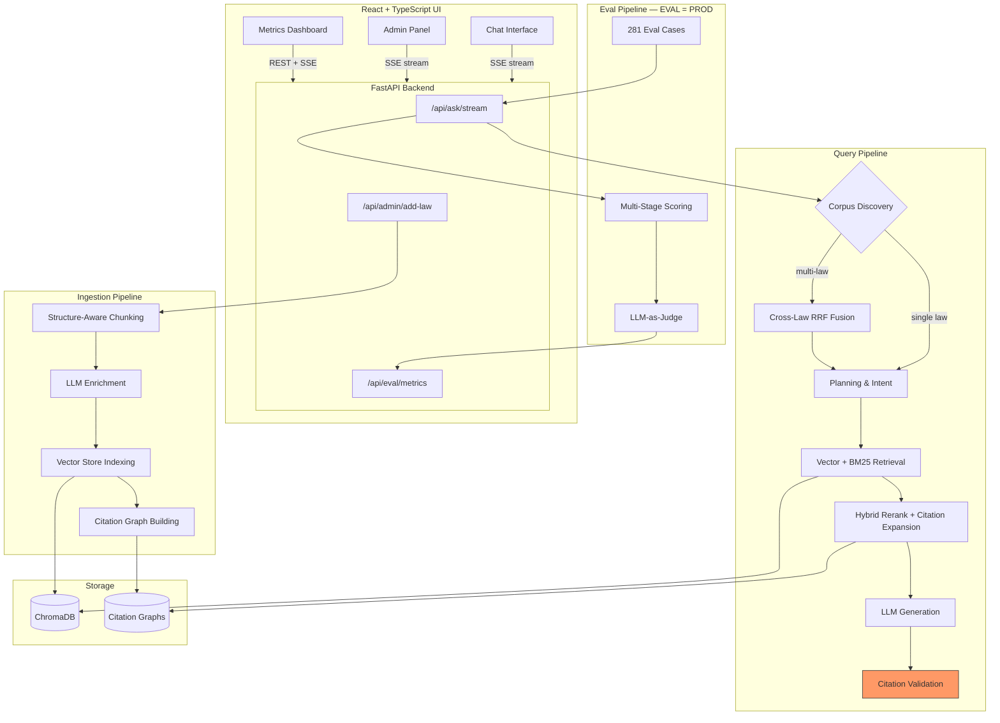
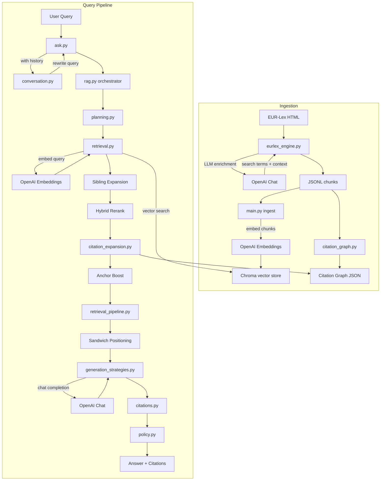
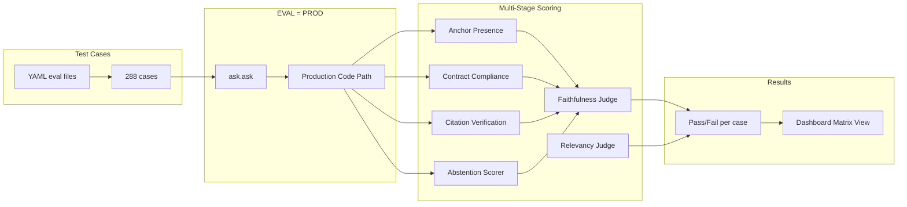
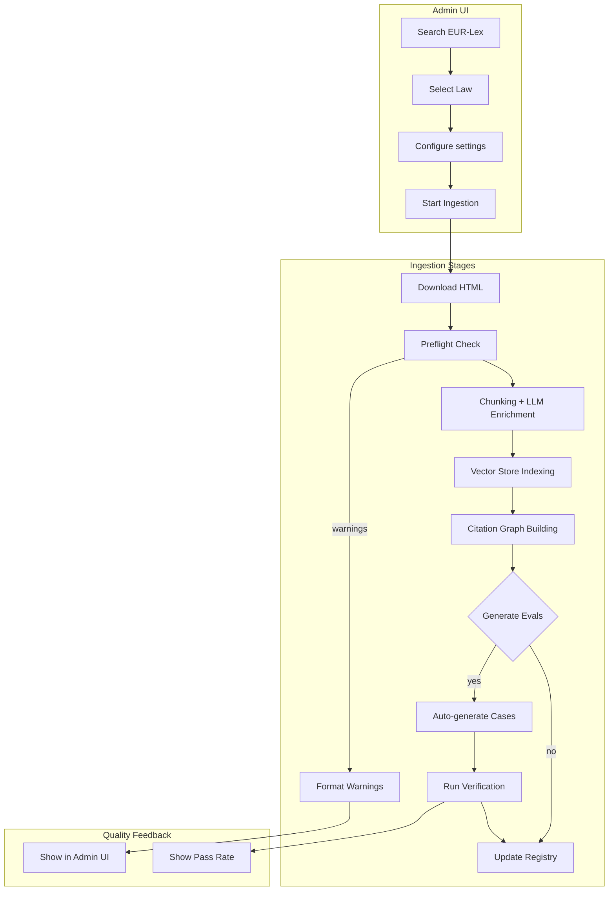
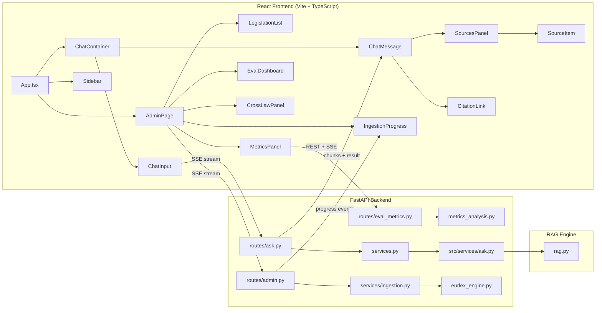
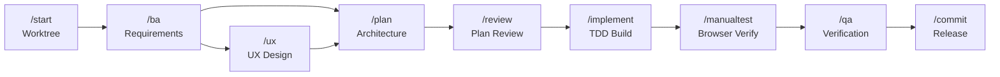

# EuLex RAG Framework


A legal Q&A system for EU legislation that **refuses to answer when evidence is insufficient** — because in regulated domains, a wrong citation has real consequences.

> Hybrid retrieval (vector + BM25 + citation graph) with fail-closed citation validation, 288 eval cases across 12 EU regulations, and LLM-as-judge quality scoring.

> **Note:** This is a proof of concept, not production software. Outputs require human review.

---

## What & Why

EU compliance teams need reliable answers about legislation — which articles apply, what the obligations are, how regulations interact. Getting this wrong has consequences: missed deadlines, incorrect filings, regulatory exposure.

EuLex answers questions about EU regulations with verified article citations. It uses hybrid retrieval to find relevant legal text, validates every citation against source chunks, and abstains when evidence is insufficient rather than guessing. An evaluation pipeline with 281 regression test cases across 12 laws measures quality continuously.

This project comes from a background in process automation and efficiency improvement of complex business processes — in capital markets (derivatives trading systems, post-trade workflows) and in development processes (CI/CD adoption, release governance). The same instinct applies: when a process has high consequences for errors, you build in verification gates and measure outcomes. Here, the "process" is retrieval-augmented generation, and the "verification gates" are citation validation, abstention scoring, and automated evaluation.

Built over 8 weeks as a proof of concept. Production would require security hardening, scalability, and audit trails — but the architecture, quality gates, and evaluation methodology would transfer directly.

---


*Cross-law query: "Hvilke love er relevante for cybersikkerhed" — AI-powered corpus discovery, multi-law retrieval, and verified citations*

## Key Features

- **Fail-closed citation design** — the retrieval-distance and citation-validation layers refuse to cite unsupported articles. Internal error handling uses permissive fallbacks (a known gap documented in the AI Act self-assessment). Correct refusals are scored separately from wrong answers.
- **EVAL = PROD** — the evaluation runner uses production code paths. No separate "test mode" that might diverge. This caught bugs that would have shipped.
- **Cross-law retrieval with corpus discovery** — queries can span multiple EU regulations simultaneously using Reciprocal Rank Fusion. AI-powered corpus discovery auto-detects relevant laws from the question, with confidence-tiered routing (auto/suggest/abstain).
- **Hybrid retrieval** — vector similarity + BM25 lexical matching + citation graph traversal. Each compensates for the others' blind spots.
- **Self-service legislation ingestion** — add any EUR-Lex law through the browser UI with preflight checks, structure-aware chunking, LLM enrichment, and closed-loop verification.
- **Eval metrics dashboard** — three-level health monitoring (trust overview → quality/performance/ingestion breakdown → drill-down) with trend detection, per-mode/per-difficulty analysis, and AI-powered insights streaming.
- **User-editable eval suites** — domain experts can run evaluations, review results, and edit test cases directly in the UI, shifting quality ownership out of developer tooling.


*Admin panel: browsing EUR-Lex, running preflight checks, ingesting new legislation*


*Eval dashboard: matrix view of test results by law, expanding to see LLM-judge scores*


*Eval metrics: drilling down through quality, performance, and ingestion health — with AI-powered analysis of what to improve*

---

## Design Decisions & Trade-offs

| Decision | Why | Trade-off |
|----------|-----|-----------|
| **Fail-closed over fail-open** | In legal contexts, a wrong citation is worse than no answer. The system abstains when retrieval confidence is low. | Users get "I don't know" more often. Requires a separate abstention scorer since standard faithfulness metrics penalize correct refusals. |
| **Hybrid retrieval over vector-only** | Semantic search misses keyword-exact legal references; BM25 misses paraphrased concepts. Citation graph captures cross-references (e.g., Article 6 → Annex III). | Three retrieval paths to tune and maintain. Four-factor ranking weights (vec/BM25/citation/role) require eval-driven calibration. |
| **Structure-aware chunking over fixed-size** | Legal text has meaningful boundaries (articles, paragraphs, annexes). Splitting mid-article breaks cross-references and context. | Chunk sizes vary widely. Some articles are too large for a single context window; others are a single sentence. Sibling expansion compensates. |
| **Citation graph built at ingestion** | Legal articles reference each other extensively. Building the graph once during ingestion enables fast traversal at query time. | Adds ~30% to ingestion time. Graph must be rebuilt when a corpus is re-ingested. |
| **LLM enrichment during ingestion** | Adding search terms and context summaries to chunks improves semantic search recall for queries that don't share vocabulary with the source text. | Adds LLM cost per chunk (~$0.15 per law). Creates a dependency on enrichment quality — bad enrichment degrades retrieval. |
| **RRF fusion for cross-law queries** | Reciprocal Rank Fusion merges ranked results from parallel per-corpus retrieval. Industry-standard, parameter-light (k=60). | Adds latency (~1s for parallel retrieval). Synthesis mode detection adds complexity (comparison vs. discovery vs. aggregation patterns). |
| **Single-model judge with escalation** | gpt-4o-mini handles ~90% of eval cases correctly at low cost. Only failures escalate to gpt-5.2. | Single-model bias. Production would need a multi-model panel and expert review. |

---

## Architecture Overview



The system has four pipelines. **Query** handles user questions through corpus discovery (auto-detecting relevant laws), planning, hybrid retrieval (vector + BM25), citation graph expansion, LLM generation, and fail-closed citation validation. **Cross-law queries** use Reciprocal Rank Fusion to merge results across corpora with synthesis modes (comparison, discovery, aggregation). **Ingestion** processes EUR-Lex HTML through structure-aware chunking, LLM enrichment, vector indexing, and citation graph building. **Evaluation** runs 281 regression test cases through the production query path with multi-stage scoring and LLM-as-judge — the metrics dashboard provides three-level health monitoring with trend detection and AI-powered analysis.

---

## Tech Stack

| Technology | Purpose | Why |
|-----------|---------|-----|
| **Python 3.11+** | Backend, RAG engine, eval pipeline | Mature ML/NLP ecosystem, type hints for SOLID architecture |
| **FastAPI** | Backend API server | Native SSE streaming, async support, auto-generated OpenAPI docs |
| **React + TypeScript** | Frontend UI | Type safety across 1,065 frontend tests, component isolation |
| **Vite** | Frontend build tool | Sub-second HMR, fast test runner (vitest) |
| **ChromaDB** | Vector store | Embedded (no infra), metadata filtering, good enough for PoC scale |
| **OpenAI API** | Embeddings + chat completion + eval judging | text-embedding-3-large for retrieval, gpt-4o-mini/gpt-5.2 for generation |
| **Tremor + Recharts** | Dashboard visualizations | Tremor for KPI cards and standard charts, Recharts for custom per-bar colouring and histograms |
| **rank_bm25** | Lexical search | Lightweight BM25 implementation, complements vector similarity |

---

## Quick Start

```bash
git clone <repo-url> && cd RAG-framework

# Python backend
python -m venv .venv && source .venv/bin/activate
pip install -r requirements.txt

# React frontend
cd ui_react/frontend && npm install && cd ../..

# Configure
cp .env.example .env   # Add your OPENAI_API_KEY

# Run
./ui_react/start.sh    # Frontend: http://localhost:5173 | API: http://localhost:8000
```

See [COMMANDS.md](COMMANDS.md) for full command reference.

---

## Technical Highlights

| Metric | Value | What it means |
|--------|-------|---------------|
| **Automated tests** | 2,773 passed | 1,708 backend (pytest) + 1,065 frontend (vitest) |
| **Test coverage** | 60% | Critical paths covered; required minimum 55% |
| **Eval cases** | 281 | Regression test cases across 12 EU regulations (~99% auto-generated) |
| **Eval pass rate** | 99.2% | Regression detection rate after model escalation (gpt-4o-mini → gpt-5.2 for ~10% of cases) |
| **LLM judge thresholds** | ≥75% faithfulness, ≥75% relevancy | Answer quality scoring |
| **Engine modules** | 30 Python files | SOLID-structured: single responsibility, dependency inversion, no circular imports |

### Supported Legislation

**12 EU laws currently indexed:** AI Act, GDPR, DORA, NIS2 (Directive + CIR), Data Act, ELAN, REARM-Europe, Reg-Sandkasser, Cyberrobusthed, EUCS (DR + CIR).

The ingestion pipeline can add any EUR-Lex legislation that passes preflight checks.

---

<details>
<summary><strong>Query & Ingestion Pipeline</strong></summary>



</details>

<details>
<summary><strong>Eval Pipeline</strong></summary>



</details>

<details>
<summary><strong>Admin Ingestion Pipeline</strong></summary>



</details>

<details>
<summary><strong>React UI Architecture</strong></summary>



</details>

<details>
<summary><strong>Architecture Details</strong></summary>

`src/engine/rag.py` is the orchestrator. `src/services/ask.py` is the public API entry point.

**Engine modules** (`src/engine/`, 30 files):
- **rag.py**: Pipeline orchestrator
- **retrieval.py**: ChromaDB queries, vector search
- **ranking.py**: Hybrid BM25+vector rerank, citation boost
- **planning.py**: Intent detection, where-filter construction
- **citations.py**: Reference extraction from LLM output
- **generation_strategies.py**: Structured generation (JSON mode, repair loops)
- **llm_client.py**: OpenAI API communication
- **policy.py**: Fail-closed gates, citation validation
- **prompt_builder.py**: Context formatting, **prompt_templates.py**: Prompt templates
- **retrieval_pipeline.py**: Pipeline stages
- **citation_expansion.py**: Graph-based retrieval augmentation
- **conversation.py**: Query rewriting for multi-turn
- **multi_corpus_retrieval.py**: Cross-law retrieval, **synthesis_router.py**: Multi-corpus fusion
- **corpus_discovery.py**: Auto corpus detection, **corpus_resolver.py**: Corpus resolution
- **intent_router.py**: Intent routing
- **generation_types.py**: Generation type definitions
- **engineering_json_mode.py**: Engineering JSON, **legal_json_mode.py**: Legal JSON
- **summary_generation.py**: Summary generation
- **contract_validation.py**: Contract validation
- **concept_config.py**: Per-corpus policy rules
- **indexing.py**: Vector store indexing
- **instrumentation.py**: Logging and metrics
- **constants.py**: Shared constants
- **types.py**: Shared enums and dataclasses
- **helpers.py**: Stateless utilities

</details>

<details>
<summary><strong>Retrieval Pipeline Details</strong></summary>

The retrieval pipeline has six stages:

### 1. Planning (`planning.py`)
- Detects intent (STRUCTURE, CHAPTER_SUMMARY, ARTICLE_SUMMARY, FREEFORM)
- Builds ChromaDB where-filter from UI focus and question
- Extracts explicit article/chapter references

### 2. Vector Retrieval (`retrieval.py`)
- Embeds query via OpenAI
- Searches ChromaDB with where-filter
- Fetches 50 candidates (configurable)

### 3. Sibling Expansion
- For each chunk, fetches adjacent chunks with same `location_id`
- Provides complete context when articles span chunks

### 4. Hybrid Rerank (`ranking.py`)

Combines four scoring factors:

```
score = α*vec_similarity + β*bm25_score + γ*citation_boost + δ*role_alignment
```

| Factor | Weight | Description |
|--------|--------|-------------|
| Vector similarity (α) | 0.25 | Semantic embedding distance |
| BM25 score (β) | 0.25 | Lexical keyword matching |
| Citation boost (γ) | 0.35 | Chunks matching citation graph |
| Role alignment (δ) | 0.15 | Query intent matching |

### 5. Citation Expansion (`citation_expansion.py`)
- Extracts seed articles from question and top chunks
- Looks up related articles in citation graph
- Injects additional chunks and applies boost

### 6. Context Selection (`retrieval_pipeline.py`)
- Selects top chunks for LLM context
- Applies diversity scoring
- Respects profile-specific limits (ENGINEERING: 15, LEGAL: 20)

### Eval Scorers

| Stage | Scorer | What it measures |
|-------|--------|------------------|
| Retrieval | `anchor_presence` | Were expected articles found? |
| Augmentation | `contract_compliance` | Does context meet citation requirements? |
| Citation | `citation_verification` | Are citations semantically accurate? |
| Generation | `faithfulness` | Are claims grounded in context? |
| Generation | `answer_relevancy` | Does answer address the question? |

</details>

<details>
<summary><strong>Configuration</strong></summary>

All settings in `config/settings.yaml`.

### Key sections:
- **openai**: Model selection, temperature, timeouts
- **rag**: Retrieval pool size, context limits, ranking weights
- **embedding_enrichment**: LLM enrichment during ingestion
- **citation_expansion**: Graph-based augmentation settings
- **eval**: LLM-as-judge settings

### Ranking Weights

```yaml
rag:
  ranking_weights:
    alpha_vec: 0.25    # Vector similarity
    beta_bm25: 0.25    # BM25 lexical match
    gamma_cite: 0.35   # Citation graph boost
    delta_role: 0.15   # Role alignment
```

Override with environment variables:
```bash
RAG_ALPHA_VEC=0.20 RAG_GAMMA_CITE=0.50 ./scripts/run_eval.sh --law ai-act
```

### Model Escalation

```yaml
eval:
  model_escalation:
    enabled: true
    max_primary_retries: 3
    fallback_model: "gpt-5.2"
```

Phase 1 runs all cases with primary model. Phase 2 retries failures with fallback model.

### Environment Variables

- `OPENAI_API_KEY`: Required for LLM calls
- `OPENAI_CHAT_MODEL`: Override default model
- `RAG_DEBUG`: Enable debug logging

### API Costs (Estimates)

Per-query cost depends on the chat model. Embedding cost (text-embedding-3-large) is negligible (~$0.000007 per query).

| | gpt-4o-mini (dev) | gpt-5.2 (prod) |
|---|---|---|
| Single query | ~$0.002 (< 1¢) | ~$0.03 (~3¢) |
| Full eval suite (288 cases) | ~$1.70 | ~$6.80 |

Assumptions: ~10k input tokens per query (system prompt + 15–20 context chunks), ~750 output tokens. Eval includes LLM-as-judge scoring (gpt-4o-mini) and ~10% model escalation to gpt-5.2 for failed cases. Prices from OpenAI Standard tier (Feb 2025 — may be outdated).

</details>

<details>
<summary><strong>Installation & Running</strong></summary>

### Prerequisites
- Python 3.11+
- Node.js 18+ (for React frontend)
- OpenAI API key

### Install dependencies
```bash
# Python backend
python -m venv .venv
source .venv/bin/activate
pip install -r requirements.txt

# React frontend
cd ui_react/frontend && npm install
```

### Run UI

```bash
cd ui_react && ./start.sh
# or manually:
# Terminal 1: cd ui_react/backend && uvicorn main:app --reload --port 8000
# Terminal 2: cd ui_react/frontend && npm run dev
```

**URLs:**
- Frontend: http://localhost:5173
- Backend API: http://localhost:8000
- API Docs: http://localhost:8000/api/docs

**Features:**
- SSE streaming with typing indicator
- Clickable citations that expand to show source
- Dark mode (persisted)
- Export to Markdown or PDF
- Debug mode for retrieval metrics
- Admin UI for legislation management

**API Endpoints:**
| Endpoint | Method | Description |
|----------|--------|-------------|
| `/api/ask/stream` | POST | Answer with SSE streaming |
| `/api/corpora` | GET | List available corpora |
| `/api/examples` | GET | Example questions per corpus |
| `/api/health` | GET | Health check |
| `/api/admin/legislation` | GET | Browse EUR-Lex legislation |
| `/api/admin/add-law/stream` | POST | Ingest new law with SSE progress |
| `/api/admin/corpus/{id}` | DELETE | Remove a corpus |

</details>

<details>
<summary><strong>Add a New Corpus</strong></summary>

### Via Admin UI (easiest)

1. Start UI: `cd ui_react && ./start.sh`
2. Click hamburger menu (☰) → "Admin"
3. Search for legislation (e.g., "NIS2", "CSRD")
4. Click **[+]** and fill in details
5. Optionally enable "Generate eval cases"

The system will download, chunk, enrich, index, build citation graph, and optionally run verification tests.

### Via CLI

```bash
# Download HTML to data/raw/my-law.html, then:

# Chunk and enrich
python -m src.ingestion.eurlex_engine --corpus my-law

# Index in vector store
python src/main.py --ingest data/processed/my-law_chunks.jsonl

# Build citation graph
python -c "from src.ingestion.citation_graph import CitationGraph; g = CitationGraph.from_corpus('my-law'); g.save()"

# Verify
./scripts/run_eval.sh --law my-law --skip-llm
```

</details>

<details>
<summary><strong>Security & Privacy</strong></summary>

### Data Privacy
- Prompts are sent to OpenAI API
- Do not use sensitive data without reviewing your data handling requirements
- Output is not legal advice

### Network Security
- All server bindings are localhost-only (127.0.0.1)
- No ports exposed to internet
- All external connections are outbound only

### EUR-Lex Integration
- URL whitelist: only `eur-lex.europa.eu` and `publications.europa.eu`
- HTTPS-only connections
- CELEX number validation
- Rate limiting: 1 request/second with 24-hour cache
- File size limit: 50MB

</details>

<details>
<summary><strong>AI Act Self-Assessment</strong></summary>

This system explains EU legislation — including the AI Act itself. So the natural question is: *would this system comply with the regulation it serves?*

**Classification.** Under Article 6 and Annex III (Section 8a), EuLex would be **high-risk** if deployed for judicial authorities to interpret law for specific cases. As a reference tool and proof of concept, it likely qualifies for the Article 6(3) exemption (preparatory work that doesn't replace human judgment). A production deployment would require a formal classification assessment — which this project does not have.

**Gap analysis against key articles:**

| Article | Requirement | PoC Status | Production would need |
|---------|-------------|------------|----------------------|
| **Art. 50** (Transparency) | Users must know they interact with AI | Partial — small disclaimer in chat UI, missing from PDF exports and API responses | Prominent disclosure on every surface, including exported documents |
| **Art. 13** (Information to deployers) | Document intended purpose, accuracy, known limitations | Partial — README covers some, but no formal Annex IV documentation | Structured technical documentation per Annex IV |
| **Art. 14** (Human oversight) | Effective monitoring, override capability, automation bias warnings | Missing — system is fully automated with no human-in-the-loop | Review queue, override mechanism, explicit automation bias warning |
| **Art. 9** (Risk management) | Documented risk assessment, foreseeable misuse analysis | Missing — fail-closed is implicit mitigation but not documented as such | Formal risk register, post-market monitoring, misuse scenarios |

**Known implementation gaps:**
- Multi-turn conversations reduce the abstention safety check — the fail-closed guarantee is weaker in follow-up questions than in initial queries
- ~99% of eval cases are auto-generated (278 of 281), creating circular validation — the eval suite validates system consistency (regression detection), not legal accuracy. Adversarial and expert-crafted cases would provide stronger quality evidence
- Exception handling in core modules silently suppresses errors in some paths, which contradicts the fail-closed philosophy

The point is not that a proof of concept should be fully compliant — it shouldn't. The point is knowing exactly where the gaps are and what closing them would require.

</details>

<details>
<summary><strong>AI-Assisted Development Workflow</strong></summary>

Each feature passes through a structured pipeline with dedicated AI roles and mandatory human checkpoints. Three workflow modes: **flow** (full pipeline with worktree isolation), **hotfix** (quick TDD fix), and **standalone** (no worktree).

### Pipeline Flow



### Pipeline Roles (23 commands)

| Command | Role | Output |
|---------|------|--------|
| `/productmanager` | Product Manager | Backlog review, prioritization, strategic analysis |
| `/start` | Setup | Create worktree + feature branch |
| `/start-hotfix` | Setup | Create hotfix worktree for quick fixes |
| `/ba` | Business Analyst | Requirements + acceptance criteria |
| `/ux` | UX Designer | Design flows + accessibility review |
| `/plan` | Architect | Component design + SOLID verification |
| `/review` | Senior Dev | Feasibility check + risk assessment |
| `/implement` | Lead Dev | TDD implementation (test first, then code) |
| `/manualtest` | Manual Tester | Browser verification + debug/fix loop + test log |
| `/hotfix` | Lead Dev | TDD bug fix with manual test (1-2 files) |
| `/qa` | QA Engineer | Test coverage + regression check |
| `/commit` | Release | Conventional commit + merge |

### Utility Commands

| Command | Use when |
|---------|----------|
| `/status` | Check current flow position and next step |
| `/checkpoint` | Save tagged progress mid-flow without closing |
| `/sync` | Pull latest main into active feature branch |
| `/docs` | Update or audit documentation |
| `/docs readme` | Rewrite README for portfolio + technical audience |
| `/commit-readme` | Auto-update README stats from codebase, commit + push |
| `/critic` | Challenge assumptions with research |
| `/idea` | Explore an idea through dialog, then dismiss or add to backlog |
| `/cleaner` | Remove temp and generated files |
| `/cleaner public` | Sanitize repo for public release (no history, no secrets) |
| `/recover` | Fix merge conflicts, stale worktrees, mid-flow interruptions |
| `/refreshclaude` | Reload CLAUDE.md mid-session after instruction changes |
| `/init` | Quick-start guide for new contributors |

### Human Checkpoints

Every phase ends with a checkpoint: **approve** (continue to next phase), **amend** (revise), or **stop** (pause and resume later). The AI cannot skip phases or auto-approve — each gate requires explicit human judgment.

### Audit Trail

Each approved phase commits its artifact to the feature branch:

```
git log --oneline feature/dark-mode

a1b2c3d  docs(dark-mode): QA report
b2c3d4e  docs(dark-mode): manual test log
e4f5g6h  feat(ui): implement dark-mode
i7j8k9l  docs(dark-mode): design UX
m0n1o2p  docs(dark-mode): architect plan
q3r4s5t  docs(dark-mode): define requirements
```

Every decision is traceable in git history. Abandoned features keep their approved artifacts on the branch.

### Worktrees

Each feature gets its own git worktree (`../eulex-<feature>/`), sharing the virtual environment, vector store, and node modules via symlinks. This enables parallel feature development without branch switching.

</details>

<details>
<summary><strong>Key Learnings</strong></summary>

### About AI Quality & Governance

1. **Fail-closed beats fail-open.** Legal systems can't guess. Citation validation flags unverified claims — the system is prompted to abstain rather than risk a wrong reference.

2. **Quality requires measurement.** 281 eval cases, LLM-as-judge scoring, regression testing before any change. Without metrics, "it seems to work" is the best you can say.

3. **EVAL = PROD.** The eval runner uses production code paths. No separate "test mode" that might diverge. This caught bugs that would have shipped otherwise.

4. **Abstention needs separate scoring.** Standard faithfulness metrics give 0 to correct refusals. A separate scorer for abstention cases was necessary.

5. **User-editable eval suites are a differentiator.** End users can run evaluations, review results, and edit test cases directly in the UI. This shifts quality ownership to domain experts.

### About Retrieval Systems

1. **Structure-aware chunking matters.** Splitting on article/paragraph boundaries preserves legal structure. Text-based chunking breaks cross-references.

2. **Vector search alone isn't enough.** Semantic similarity misses related articles. Hybrid search (vector + BM25 + citation graph) catches what pure vector search misses.

3. **Citation graphs capture relationships.** Articles that reference each other (e.g., Article 6 → Annex III) should be retrieved together. Building a citation graph during ingestion enables this.

4. **LLM-enriched chunks improve search.** Adding search terms and context summaries during ingestion helps semantic search find relevant content that wouldn't match on keywords alone.

### About Building Software with AI

1. **AI needs governance, not freedom.** Left undirected, the AI proposed duplicate modules, hardcoded values, and infinite debugging loops. A structured workflow (`/plan → /implement → /qa`) with mandatory checkpoints was the single most impactful quality improvement.

2. **The hard skill is knowing when the AI is wrong.** Catching root causes the AI missed during debugging. Stopping refactoring when returns diminished. Rejecting new modules when existing ones already solved the problem. You don't need to write code to make these calls — you need to understand the system well enough to evaluate what the AI proposes.

3. **Refactoring is an investment, not a cost.** 11 numbered refactoring phases were painful. But now each module has one job, and changes to retrieval logic don't touch generation.

4. **SOLID principles become essential at scale.** Early code worked but was fragile. After refactoring, the peripheral modules are well-decomposed with single responsibilities and dependency inversion. The core orchestrator is still large — knowing when to stop refactoring is itself a judgment call.

5. **Removing features is a skill.** TOC-guided routing, concept-based routing, a Streamlit UI — all built and then removed when they added complexity without improving retrieval.

### Development Approach

This project was built with AI coding assistants, directed by someone who reads and evaluates code but doesn't write it from scratch. The engineering decisions — what to build, when to rebuild, when to stop — were mine.

The project didn't start with TDD or SOLID principles. Those came after paying the cost of not having them. The progression was gradual: first asking for tests in prompts, then noticing the AI didn't always comply, then building workflow rules that made skipping tests impossible.

### What I'd Do Differently

- Start with the structured workflow (`/ba → /plan → /implement → /qa`) before writing any code — it was the single most impactful improvement
- TDD from day one — retrofitting tests cost 11 refactoring phases
- Playwright for UI integration tests — the frontend has unit tests but no end-to-end user flow coverage
- A deep research phase before every significant design decision — the best technical choices (citation graphs, fail-closed, abstention scoring) all came from researching best practices first

</details>

<details>
<summary><strong>Limitations</strong></summary>

### LLM-as-Judge Limitations

The automated evaluation uses gpt-4o-mini as primary judge for faithfulness and relevancy scoring, with model escalation to gpt-5.2 for cases that fail on the first pass. This is a deliberate tradeoff:

**Current implementation (proof of concept):**
- Single model judge with escalation — cost-effective while maintaining quality
- Automated pipeline verification — confirms system works end-to-end
- Regression detection — catches obvious quality degradation

**Production requirements (not implemented):**
- Multi-model judge panel — reduces single-model bias
- Legal expert verification — lawyers reviewing and expanding eval suites
- Manual spot-checking — human review of edge cases
- Adversarial testing — deliberately challenging the system

### Scope
- **Danish-focused**: Eval cases are in Danish
- **EUR-Lex specific**: Ingestion assumes EUR-Lex HTML structure

### Not Implemented
- Query decomposition for multi-concept questions
- Incremental ingestion (requires full re-index)

### Untested Paths
- Eval cases are single-turn only — multi-turn query rewriting is not covered by the eval suite
- Abstention false negative rate is not measured — how often the system refuses a correct question is unknown
- Changing the embedding model (text-embedding-3-large) requires full re-ingestion of all corpora

### Testing
- Integration tests require API keys and pre-built vector store
- Some multi-concept cases pass reliably with GPT-5 but may fail with GPT-4o-mini

</details>

<details>
<summary><strong>Contributing</strong></summary>

- Issues and suggestions welcome
- Pre-commit hook runs syntax check and tests
- Skip with `git commit --no-verify` if needed
- For full validation: `./scripts/run_eval.sh --law all`

</details>

---

## License

MIT License. See [LICENSE](LICENSE).
